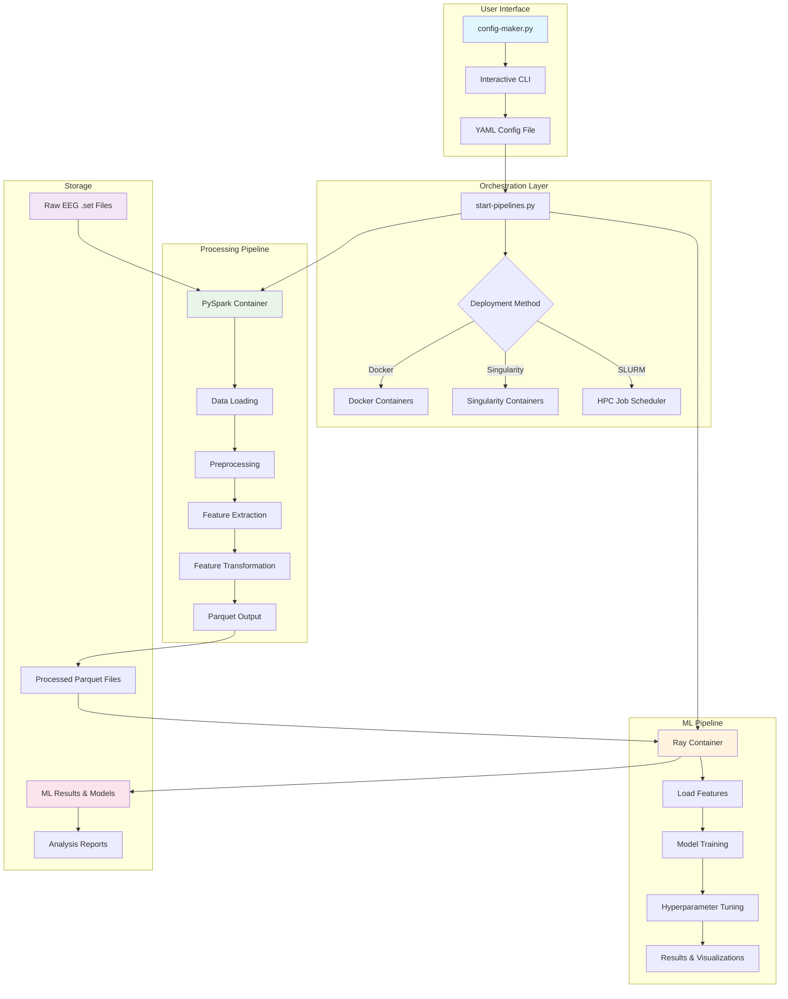
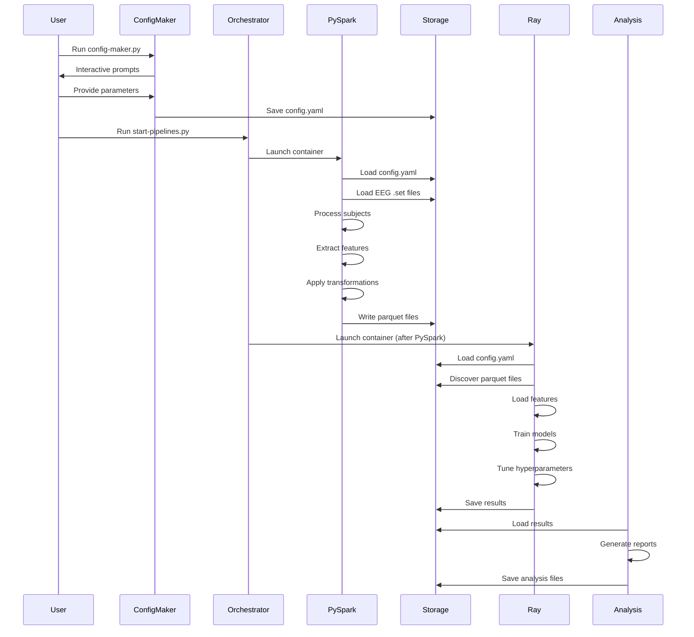
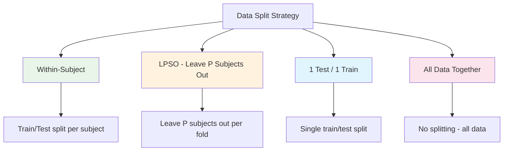
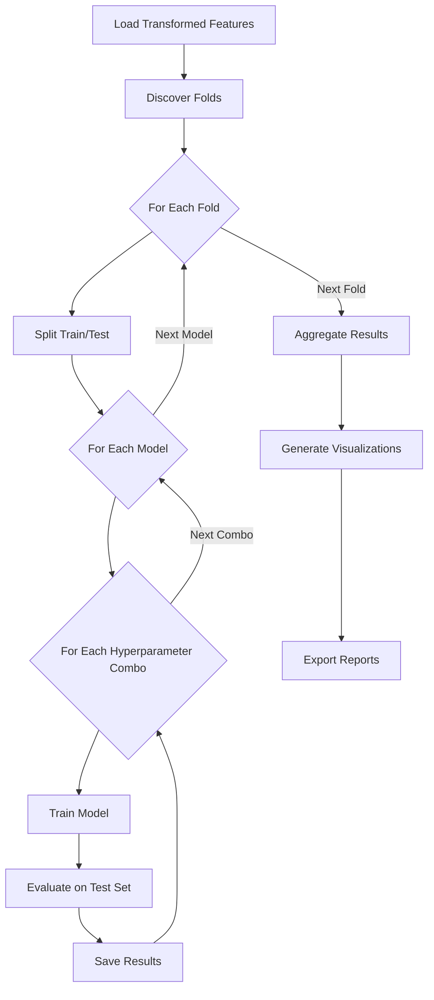

# EEG Full Pipeline - Complete Project Overview

## 📋 Table of Contents
1. [Project Overview](#project-overview)
2. [System Architecture](#system-architecture)
3. [Core Components](#core-components)
4. [Data Flow](#data-flow)
5. [Configuration System](#configuration-system)
6. [Machine Learning Pipeline](#machine-learning-pipeline)
7. [Analysis & Results](#analysis--results)
8. [Deployment Options](#deployment-options)
9. [Key Features](#key-features)

---

## Project Overview

The **EEG Full Pipeline** is a comprehensive, containerized system for processing electroencephalography (EEG) data and performing machine learning classification. It's designed to handle large-scale EEG datasets (like Alzheimer's disease studies) with distributed processing capabilities.

### Purpose
- **EEG Signal Processing**: Preprocess raw EEG data, extract features, and transform them for ML
- **Machine Learning**: Train and optimize multiple ML models with hyperparameter tuning
- **Scalability**: Run on local machines, Docker, or HPC clusters (SLURM)
- **Reproducibility**: Configuration-driven pipeline with hash-based caching

### Technology Stack
- **PySpark**: Distributed data processing and feature extraction
- **Ray Tune**: Distributed hyperparameter optimization
- **Docker/Singularity**: Containerization for portability
- **Parquet**: Columnar data storage format
- **Python 3.10+**: Core programming language

---

## System Architecture

### High-Level Architecture



### Container Architecture

```mermaid
graph LR
    subgraph "PySpark Container"
        A1[main.py] --> A2[Data I/O]
        A2 --> A3[Preprocessing]
        A3 --> A4[Feature Extraction]
        A4 --> A5[Transformers]
        A5 --> A6[Parquet Writer]
    end
    
    subgraph "Ray Container"
        B1[main.py] --> B2[Data Discovery]
        B2 --> B3[Model Runner]
        B3 --> B4[Search Strategies]
        B4 --> B5[Ray Tune]
        B5 --> B6[Results Exporter]
    end
    
    subgraph "Shared Mounts"
        C1[/app/config.yaml]
        C2[/app/data/]
        C3[Input EEG Files]
    end
    
    A1 --> C1
    B1 --> C1
    A6 --> C2
    B2 --> C2
    A2 --> C3
    
    style A1 fill:#4caf50
    style B1 fill:#ff9800
    style C1 fill:#2196f3
    style C2 fill:#9c27b0
```

---

## Core Components

### 1. PySpark Pipeline (`eeg-pyspark-pipeline/`)

**Purpose**: Distributed EEG data processing and feature extraction

**Key Modules**:
- **`core/data_io.py`**: Load EEG .set files using MNE-Python
- **`core/session_builder.py`**: Configure Spark sessions for distributed processing
- **`processing/process_subject.py`**: Process individual subjects through the pipeline
- **`features/feature_extraction_helper.py`**: Extract features (band power, spectral entropy, etc.)
- **`features/transformers/`**: Feature transformations (PCA, ANOVA, scaling, etc.)

**Processing Stages**:
1. **Raw Data Loading**: Read EEG .set files
2. **Preprocessing**: Filtering, downsampling, artifact removal
3. **Feature Extraction**: 
   - Frequency domain: Band power, spectral entropy
   - Time domain: Energy, RMS, Hjorth parameters, skewness, kurtosis
4. **Feature Transformation**: PCA, ANOVA F-test, scaling, normalization
5. **Output**: Write to Parquet format

### 2. Ray Tuner (`eeg-ray-tuner/`)

**Purpose**: Distributed hyperparameter optimization and model training

**Key Modules**:
- **`tuning/ray_tuner.py`**: Main orchestration for Ray Tune experiments
- **`tuning/base_search_strategy.py`**: Base class for search strategies
- **`tuning/grid_search_strategy.py`**: Grid search implementation
- **`tuning/ax_search_strategy.py`**: Bayesian optimization with Ax
- **`models/model_runner.py`**: Train and evaluate ML models
- **`results/result_aggregator.py`**: Aggregate results across folds/trials
- **`visualization/`**: Generate performance graphs and reports

**Supported Models**:
- Random Forest
- XGBoost
- MLP (Neural Network)
- KNN (K-Nearest Neighbors)
- SVM (Support Vector Machine)
- Logistic Regression
- Decision Tree
- Gradient Boosting
- AdaBoost

### 3. Configuration System (`config-maker.py`)

**Purpose**: Interactive CLI to generate YAML configuration files

**Configuration Sections**:
1. **Project Metadata**: Name, experiment type, output directory
2. **Data Input**: EEG file paths, subject groups
3. **Preprocessing**: Filtering, downsampling, artifact handling
4. **Feature Extraction**: Methods (Welch/Multitaper), feature types
5. **Feature Transformation**: PCA, ANOVA, scaling, normalization
6. **Data Leakage Prevention**: Split strategies (within-subject, LPSO, etc.)
7. **Ray Configuration**: Cluster setup, search strategies, model configs

---

## Data Flow

### Complete Pipeline Flow



### Data Structure

```
data/
└── {project_name}/
    ├── processed_subjects/
    │   └── fold_*/  (or lpso_*, train/, test/, all/)
    │       └── *.parquet
    └── transformed/
        └── fold_*/  (or lpso_*, train/, test/, all/)
            └── *.parquet
    └── ml_results_{strategy}/
        ├── detailed_results/
        │   ├── {Model}/
        │   │   ├── fold_*/
        │   │   │   ├── trial_*.json
        │   │   │   └── predictions.csv
        │   │   └── aggregated_results.json
        └── visualizations/
            └── *.png
```

---

## Configuration System

### Unified Configuration Handler

Both PySpark and Ray containers use the same `UnifiedConfigHandler` to read and validate configuration:

```python
# Key features:
- Single source of truth (one YAML file)
- Validation on load
- Hash-based caching for reproducibility
- Path resolution (container vs host)
```

### Configuration Hash System

The system uses MD5 hashes to:
- **Cache processed data**: Skip reprocessing if config hasn't changed
- **Ensure reproducibility**: Same config = same output
- **Track experiments**: Hash identifies unique experiment configurations

### Example Configuration Structure

```yaml
project:
  name: "alzheimers_study"
  experiment_type: "ML Classification"
  output_dir: "./data"
  
data_input:
  groups:
    control: ["/path/to/control/*.set"]
    alzheimer: ["/path/to/alzheimer/*.set"]
    
preprocessing:
  filter_low: 1.0
  filter_high: 40.0
  downsampling_rate: 250.0
  
feature_extraction:
  method: "welch"
  features:
    per_channel_per_band:
      - "band_power"
      - "relative_band_power"
      
feature_transformation:
  transformations:
    - "PCA (retain 95% variance)"
    - "Z-score standardization"
    
data_leakage_prevention:
  strategy: "LPSO"
  n_folds: 6
  
ray:
  cluster:
    num_workers: 4
  search_strategy: "grid_search"
  models:
    - "Random Forest"
    - "XGBoost"
```

---

## Machine Learning Pipeline

### Search Strategies

#### 1. Grid Search
- **Type**: Exhaustive search
- **Use Case**: Small hyperparameter spaces
- **Method**: Tests all combinations of discrete values

#### 2. Ax (Bayesian Optimization)
- **Type**: Adaptive search
- **Use Case**: Large hyperparameter spaces
- **Method**: Uses Gaussian processes to intelligently explore space

### Data Leakage Prevention Strategies



### Model Training Flow



---

## Analysis & Results

### Result Structure

The pipeline generates comprehensive results including:

1. **Per-Trial Results**: Individual model training results
2. **Per-Fold Aggregation**: Results aggregated across folds
3. **Per-Subject Analysis**: Subject-level performance metrics
4. **Cross-Model Comparisons**: Performance across different models
5. **Hyperparameter Analysis**: Impact of hyperparameters on performance

### Analysis Scripts

Located in `data/HPC_All_Data/`:

- **`analyze_per_subject_improved.py`**: Per-subject accuracy analysis by model×hyperparameter
- **`analyze_per_subject_accuracy_by_model_hyperparam.py`**: Detailed breakdowns
- **Generated Reports**:
  - `per_subject_accuracy_improved_report.md`: Top subjects with largest swings
  - `per_subject_accuracy_by_model_hyperparam.md`: Comprehensive analysis
  - `biggest_cross_model_swings.md`: Quick reference for top performers

### Key Metrics

- **Accuracy**: Classification accuracy per subject
- **Swing**: Cross-model variance (max - min accuracy)
- **Confidence Intervals**: 95% CIs using binomial approximation
- **Fold Comparability**: Ensures same folds compared across models

---

## Deployment Options

### 1. Docker (Local Development)

```bash
python start-pipelines.py config.yaml
# Runs both containers sequentially
```

**Features**:
- Fast iteration
- Port forwarding for Spark UI (4040) and Ray Dashboard (8265)
- Easy debugging

### 2. Singularity (HPC Compatible)

```bash
# Without SLURM (interactive)
python start-pipelines.py config.yaml

# With SLURM (job scheduling)
python start-pipelines.py config.yaml
# Automatically submits SLURM jobs
```

**Features**:
- HPC cluster compatibility
- Automatic job dependency management
- Resource allocation via SLURM

### 3. Container Building

The system automatically:
- Checks for existing `.sif` files
- Builds from Docker images if missing
- Supports both local and SLURM-based builds

---

## Key Features

### 1. Distributed Processing
- **PySpark**: Parallel processing across multiple nodes
- **Ray**: Distributed hyperparameter tuning
- **Scalable**: From single machine to HPC clusters

### 2. Reproducibility
- **Configuration Hashing**: MD5 hashes track experiments
- **Deterministic Processing**: Same config = same results
- **Version Control**: Config files tracked in git

### 3. Flexibility
- **Multiple Models**: 9 different ML algorithms
- **Multiple Search Strategies**: Grid search and Bayesian optimization
- **Multiple Split Strategies**: Various data leakage prevention methods

### 4. Comprehensive Analysis
- **Per-Subject Metrics**: Individual subject performance
- **Cross-Model Comparisons**: Model performance analysis
- **Visualization**: Automated graph generation
- **Statistical Analysis**: Confidence intervals, swing calculations

### 5. Containerization
- **Portability**: Works across different environments
- **Isolation**: Dependencies contained in images
- **HPC Ready**: Singularity support for clusters

---

## Project Structure

```
eeg-full-pipeline/
├── config/                          # Configuration files
│   ├── config_*.yaml               # Generated configs
│   └── spark/                      # Spark configuration
├── data/                           # Output directory
│   └── HPC_All_Data/              # Analysis results
├── containers/                     # Container images (.sif files)
├── logs/                           # Spark and Ray logs
├── docs/                           # Documentation
├── eeg-pyspark-pipeline/           # PySpark submodule
│   ├── eeg_spark_etl/             # Core processing code
│   └── main.py                    # Entry point
├── eeg-ray-tuner/                  # Ray submodule
│   ├── eeg_ray_tuner/             # Core ML code
│   └── main.py                    # Entry point
├── config-maker.py                 # Interactive config generator
├── start-pipelines.py              # Main orchestration script
└── config_handler.py               # Unified config handler
```

---

## Usage Workflow

### 1. Create Configuration

```bash
python config-maker.py
# Interactive prompts guide you through configuration
# Output: config/config_{name}_{date}_{time}.yaml
```

### 2. Run Pipeline

```bash
python start-pipelines.py [config_file]
# Automatically:
# - Checks for containers
# - Builds if needed
# - Runs PySpark container
# - Runs Ray container
# - Saves results to data/
```

### 3. Analyze Results

```bash
cd data/HPC_All_Data/
python analyze_per_subject_improved.py
# Generates analysis reports
```

---

## Performance Characteristics

### Processing Speed
- **PySpark**: Distributed processing scales with cluster size
- **Ray**: Parallel hyperparameter tuning across workers
- **Caching**: Hash-based caching avoids reprocessing

### Resource Requirements
- **Memory**: Varies by dataset size (typically 8GB+ per worker)
- **CPU**: Multi-core recommended for parallel processing
- **Storage**: Parquet format is efficient for large datasets

### Scalability
- **Horizontal Scaling**: Add more Spark/Ray workers
- **Vertical Scaling**: Increase resources per worker
- **HPC Integration**: Leverages cluster resources via SLURM

---

## Future Enhancements

Potential areas for expansion:
- Additional ML models (e.g., deep learning)
- More feature extraction methods
- Advanced visualization capabilities
- Real-time processing support
- Cloud deployment (AWS, GCP, Azure)

---

## Summary

The **EEG Full Pipeline** is a production-ready system for:
- ✅ Large-scale EEG data processing
- ✅ Distributed feature extraction
- ✅ Hyperparameter optimization
- ✅ Multiple ML model training
- ✅ Comprehensive result analysis
- ✅ HPC cluster deployment

It provides a complete end-to-end solution from raw EEG data to ML model evaluation, with strong emphasis on reproducibility, scalability, and ease of use.

---

*Generated: November 2025*

