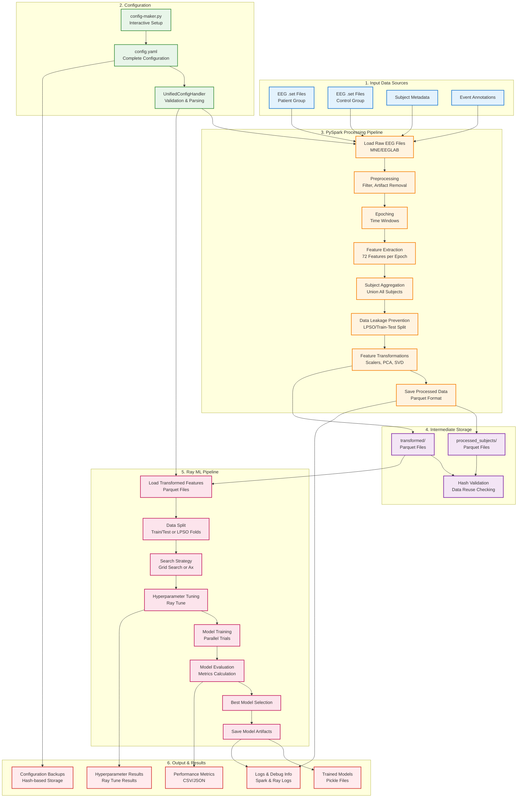
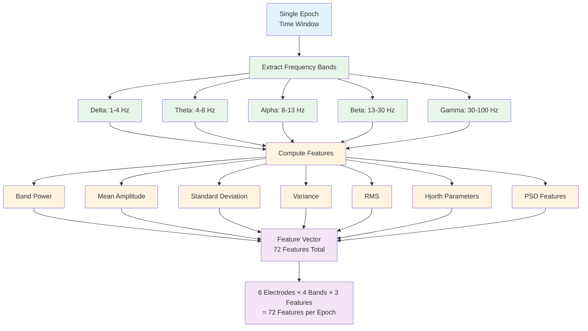
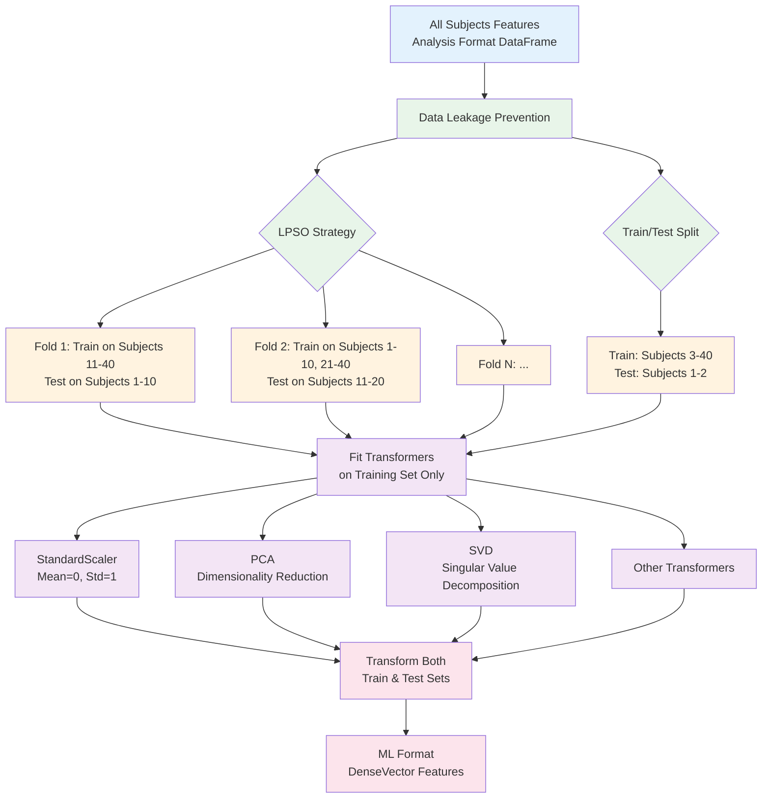
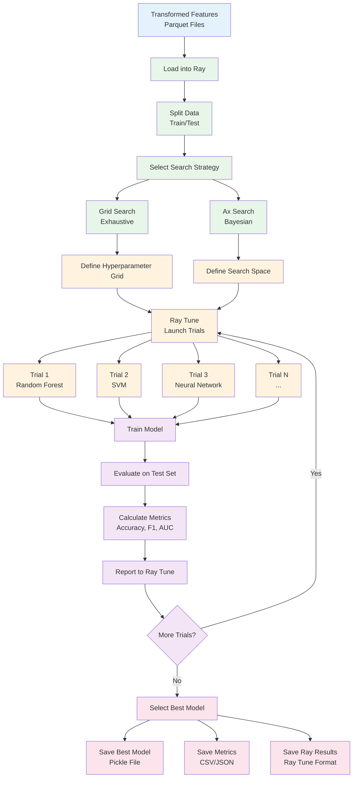
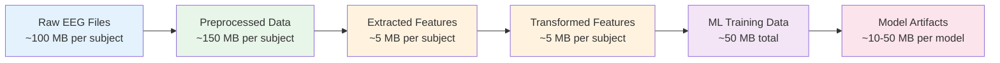
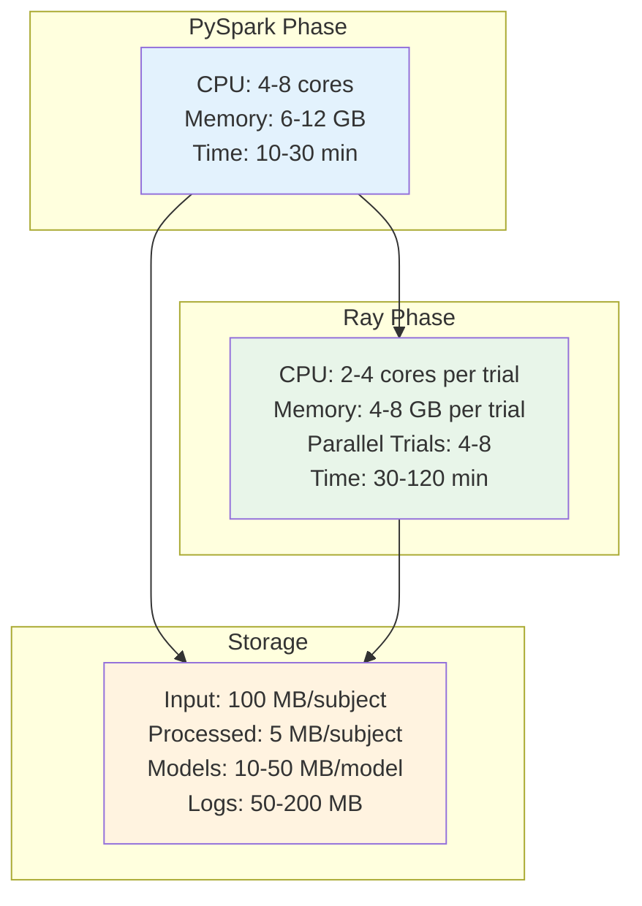

# End-to-End Data Flow Diagram

## Complete Data Journey Through the Pipeline

## Detailed Processing Stages

### Stage 1: Data Loading & Preprocessing

```mermaid
flowchart LR
    A[EEG File<br/>sub-001_eeg.set] --> B[Load with MNE<br/>or EEGLAB]
    B --> C[Raw Data<br/>Multi-channel Time Series]
    C --> D[Apply Filters<br/>Bandpass, Notch]
    D --> E[Remove Artifacts<br/>ICA, Annotations]
    E --> F[Create Epochs<br/>1-2 second windows]
    F --> G[Epoch Data<br/>Ready for Features]
    
    %% Styling
    classDef file fill:#e3f2fd
    classDef raw fill:#e8f5e9
    classDef process fill:#fff3e0
    classDef output fill:#f3e5f5
    
    class A file
    class B,C raw
    class D,E,F process
    class G output
```

### Stage 2: Feature Extraction

### Stage 3: Data Transformation

### Stage 4: Machine Learning Training

## Data Volume Flow

## Time Flow Through Pipeline

```mermaid
gantt
    title Pipeline Execution Timeline
    dateFormat X
    axisFormat %s
    
    section Configuration
    Create Config           :0, 60
    
    section PySpark Processing
    Load Data              :60, 120
    Preprocess             :120, 300
    Extract Features       :300, 600
    Transform Features     :600, 900
    Save Data              :900, 960
    
    section Ray ML Training
    Initialize Ray         :960, 1020
    Load Features          :1020, 1080
    Hyperparameter Tuning  :1080, 3600
    Model Evaluation       :3600, 3660
    Save Results           :3660, 3720
```

## Resource Usage Flow

