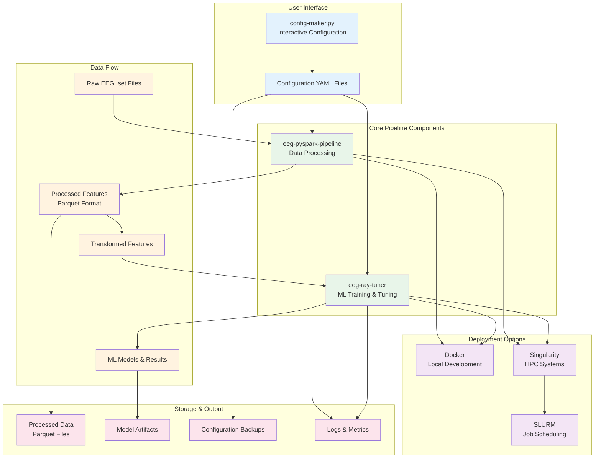
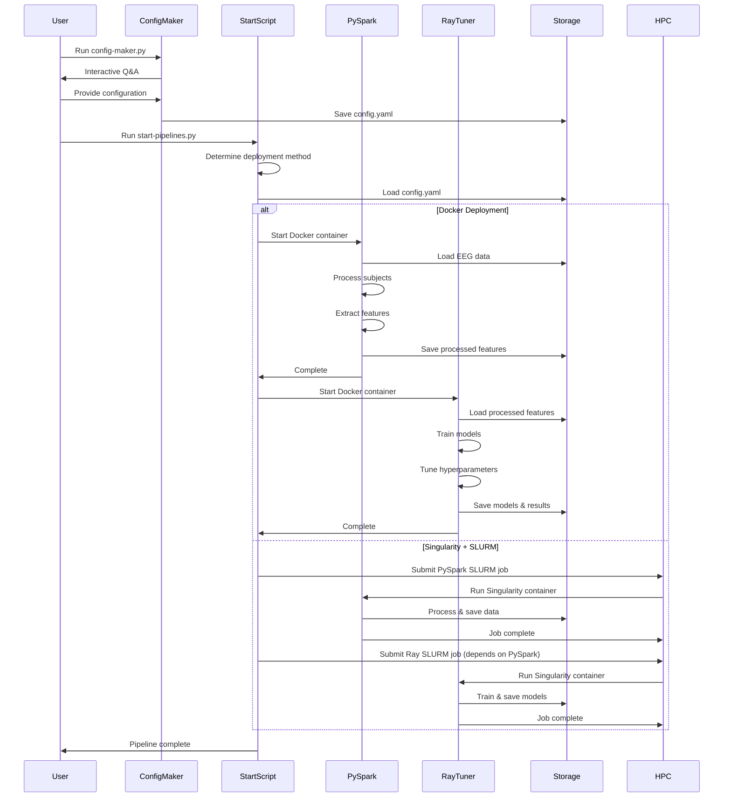
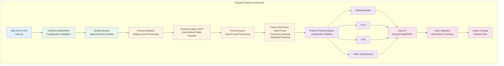
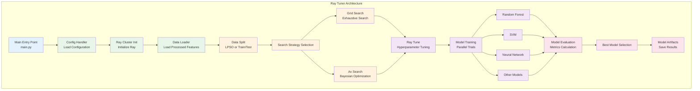
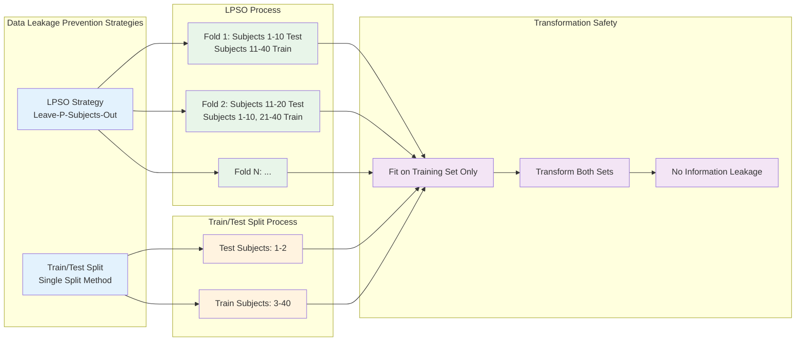
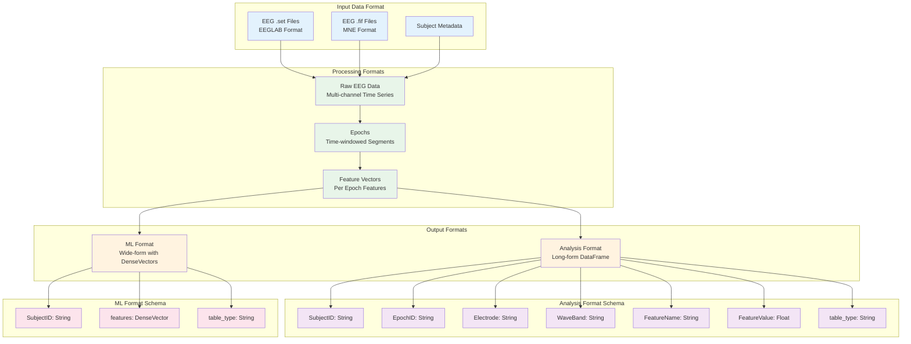
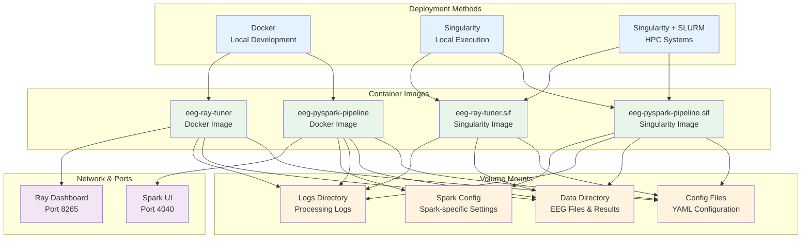
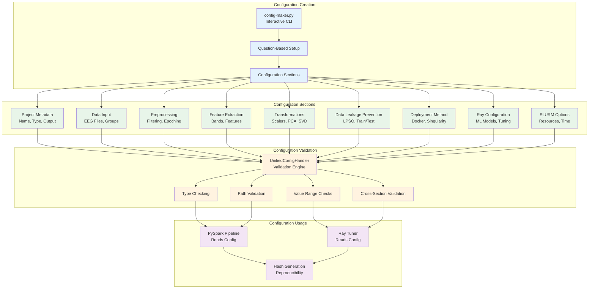
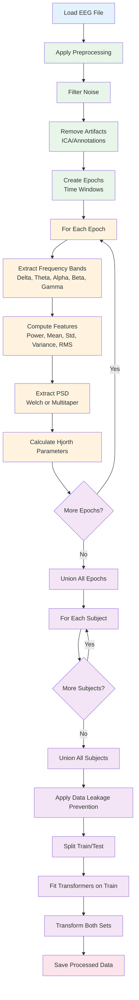

# EEG Full Pipeline - Project Overview

## 🎯 Project Purpose

The **EEG Full Pipeline** is a comprehensive, production-ready system for processing electroencephalography (EEG) data and running machine learning experiments. It's designed for researchers studying brain activity, particularly for tasks like:

- **Alzheimer's Disease Classification**: Distinguishing between patients and healthy controls
- **EEG Fingerprinting**: Identifying individual subjects from EEG patterns
- **Clustering Analysis**: Finding patterns and groups in EEG data
- **General Analysis**: Processing EEG data for manual analysis

## 🏗️ System Architecture Overview

## 📊 Complete Pipeline Flow

```mermaid
flowchart TD
    Start([Start: User Runs Pipeline]) --> Config[Create Configuration<br/>via config-maker.py]
    Config --> Deploy{Deployment Method}
    
    Deploy -->|Docker| Docker[Run Docker Containers]
    Deploy -->|Singularity| Singularity[Run Singularity Containers]
    Deploy -->|SLURM| SLURM[Submit SLURM Jobs]
    
    Docker --> SparkInit[Initialize PySpark Session]
    Singularity --> SparkInit
    SLURM --> SparkInit
    
    SparkInit --> LoadData[Load Raw EEG Data<br/>.set or .fif files]
    LoadData --> Preprocess[Preprocess Data<br/>- Filtering<br/>- Artifact Removal<br/>- Epoching]
    
    Preprocess --> ExtractFeatures[Extract Features<br/>- Band Power<br/>- Frequency Analysis<br/>- Statistical Features]
    
    ExtractFeatures --> CheckReuse{Reuse<br/>Transformed?}
    CheckReuse -->|Yes| LoadTransformed[Load Existing<br/>Transformed Data]
    CheckReuse -->|No| Transform[Apply Transformations<br/>- StandardScaler<br/>- PCA<br/>- SVD<br/>- etc.]
    
    LoadTransformed --> SaveFeatures[Save Processed Features<br/>Parquet Format]
    Transform --> SaveFeatures
    
    SaveFeatures --> MLCheck{ML Experiment?}
    MLCheck -->|No| Analysis[Analysis Output]
    MLCheck -->|Yes| RayInit[Initialize Ray Cluster]
    
    RayInit --> LoadML[Load Transformed Features]
    LoadML --> SplitData[Data Split<br/>LPSO or Train/Test]
    
    SplitData --> Tune{Search Strategy}
    Tune -->|Grid Search| GridSearch[Grid Search<br/>Hyperparameter Tuning]
    Tune -->|Ax Search| AxSearch[Bayesian Optimization<br/>Ax Framework]
    
    GridSearch --> TrainModels[Train ML Models<br/>- Random Forest<br/>- SVM<br/>- Neural Networks]
    AxSearch --> TrainModels
    
    TrainModels --> Evaluate[Evaluate Models<br/>- Accuracy<br/>- Precision/Recall<br/>- F1-Score]
    
    Evaluate --> SelectBest[Select Best Model]
    SelectBest --> SaveResults[Save Results<br/>- Models<br/>- Metrics<br/>- Configurations]
    
    SaveResults --> End([End: Results Available])
    Analysis --> End
    
    %% Styling
    classDef startEnd fill:#4caf50,color:#fff
    classDef process fill:#2196f3,color:#fff
    classDef decision fill:#ff9800,color:#fff
    classDef ml fill:#9c27b0,color:#fff
    classDef storage fill:#f44336,color:#fff
    
    class Start,End startEnd
    class Config,SparkInit,LoadData,Preprocess,ExtractFeatures,Transform,SaveFeatures process
    class Deploy,CheckReuse,MLCheck,Tune decision
    class RayInit,LoadML,SplitData,GridSearch,AxSearch,TrainModels,Evaluate,SelectBest ml
    class LoadTransformed,SaveResults,Analysis storage
```

## 🔄 Component Interaction Sequence

## 🧩 Component Architecture Details

### 1. PySpark Pipeline Component

### 2. Ray Tuner Component

## 🔐 Data Leakage Prevention

## 📦 Data Formats & Schemas

## 🚀 Deployment Architecture

## 🔧 Configuration System

## 📈 Processing Pipeline Detail

## 🎓 Key Features

### Data Processing Features
- ✅ Multi-format EEG support (.set, .fif)
- ✅ Distributed processing with PySpark
- ✅ Flexible epoching and windowing
- ✅ Multiple feature extraction methods
- ✅ Comprehensive artifact removal
- ✅ Frequency band analysis

### Machine Learning Features
- ✅ Multiple ML models (RF, SVM, NN, etc.)
- ✅ Hyperparameter tuning (Grid Search, Ax)
- ✅ Data leakage prevention (LPSO, Train/Test)
- ✅ Distributed training with Ray
- ✅ Comprehensive evaluation metrics
- ✅ Model persistence and versioning

### Production Features
- ✅ Container-based deployment
- ✅ HPC integration (Singularity, SLURM)
- ✅ Configuration management
- ✅ Data reuse and caching
- ✅ Comprehensive logging
- ✅ Error handling and validation

## 📚 Additional Documentation

For more detailed information, see:
- [Overall Architecture](./overall_architecture.md)
- [PySpark Pipeline Details](./pyspark_pipeline_diagram.md)
- [Ray Tuner Details](./ray_tuner_diagram.md)
- [Deployment Architecture](./deployment_diagram.md)
- [Configuration System](./configuration_system_diagram.md)

