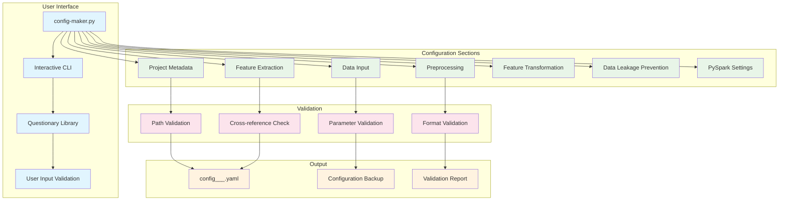
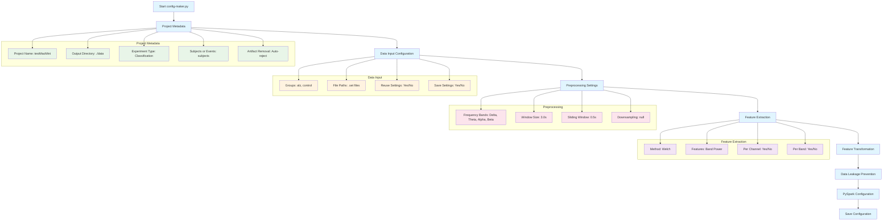
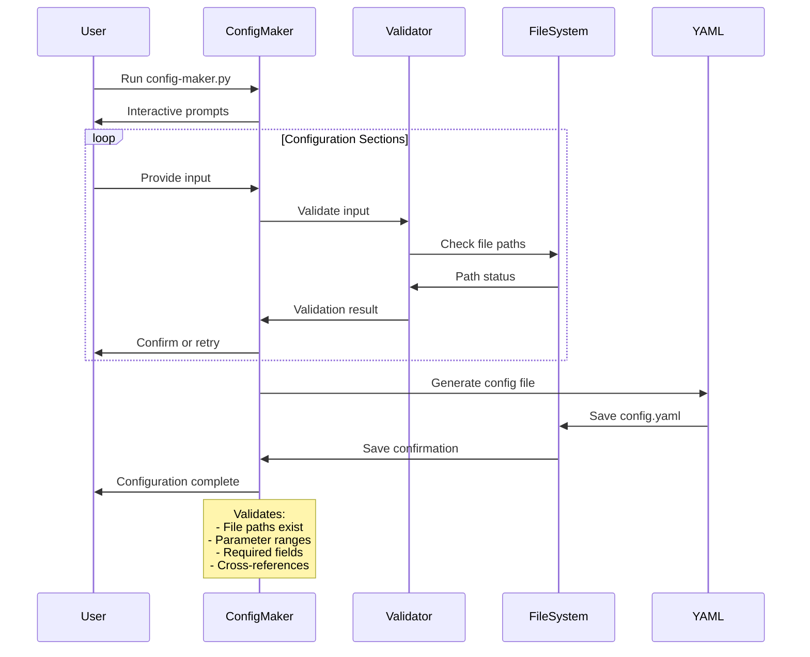
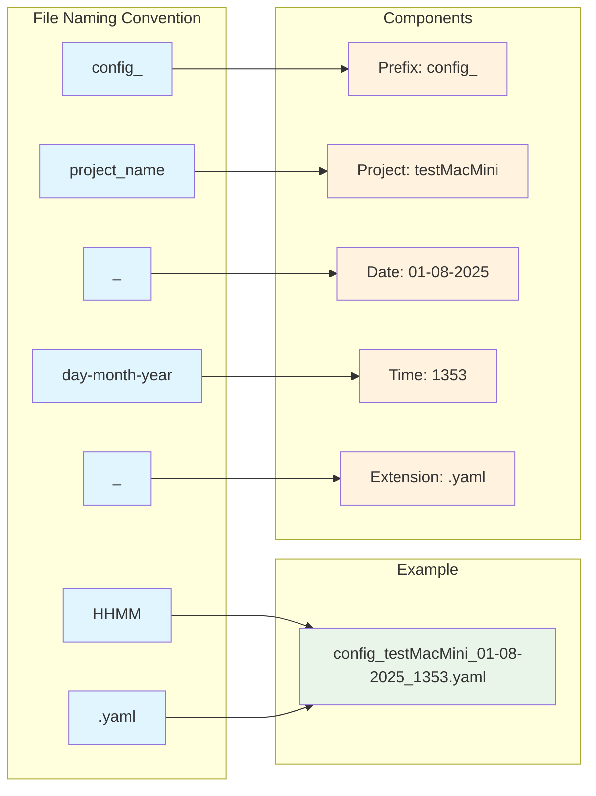
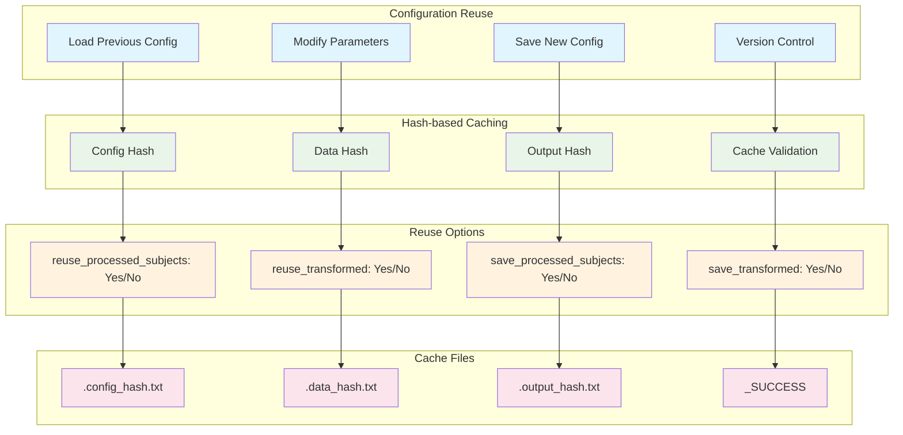

# Configuration System - Detailed Architecture

## Configuration Flow



## Interactive Configuration Process



## Configuration File Structure

```mermaid
graph TD
    %% Configuration Structure
    subgraph "Configuration File Structure"
        A[project]
        B[data_input]
        C[preprocessing]
        D[feature_extraction]
        E[feature_transformation]
        F[data_leakage_prevention]
        G[pyspark]
    end
    
    %% Project Section
    subgraph "Project Section"
        A1[name: testMacMini]
        A2[output_dir: ./data]
        A3[experiment_type: Classification]
        A4[subjects_or_events: subjects]
        A5[artifact_removal: Auto-reject]
    end
    
    %% Data Input Section
    subgraph "Data Input Section"
        B1[groups]
        B2[reuse_processed_subjects: Yes]
        B3[save_processed_subjects: Yes]
        B6[reuse_transformed: Yes]
        B7[save_transformed: Yes]
    end
    
    %% Groups Subsection
    subgraph "Groups"
        C1[alz: [sub-001, sub-002]]
        C2[control: [sub-037, sub-038]]
    end
    
    %% Preprocessing Section
    subgraph "Preprocessing Section"
        D1[bands]
        D2[window_size: 3.0]
        D3[sliding_window: 0.5]
        D4[downsampling: null]
    end
    
    %% Bands Subsection
    subgraph "Frequency Bands"
        E1[Delta: [0.5, 4]]
        E2[Theta: [4, 8]]
        E3[Alpha: [8, 12]]
        E4[Beta: [12, 30]]
    end
    
    %% Feature Extraction Section
    subgraph "Feature Extraction Section"
        F1[method: Welch]
        F2[features: [Band Power]]
    end
    
    %% PySpark Section
    subgraph "PySpark Section"
        G1[master: 4]
        G2[driver_memory: 6]
        G3[executor_memory: 6]
        G4[executor_cores: 2]
        G5[shuffle_partitions: 8]
    end
    
    %% Connections
    A --> A1
    A --> A2
    A --> A3
    A --> A4
    A --> A5
    
    B --> B1
    B --> B2
    B --> B3
    B --> B4
    B --> B5
    B --> B6
    B --> B7
    
    B1 --> C1
    B1 --> C2
    
    C --> D1
    C --> D2
    C --> D3
    C --> D4
    
    D1 --> E1
    D1 --> E2
    D1 --> E3
    D1 --> E4
    
    D --> F1
    D --> F2
    
    G --> G1
    G --> G2
    G --> G3
    G --> G4
    G --> G5
    
    %% Styling
    classDef main fill:#e1f5fe
    classDef project fill:#e8f5e8
    classDef data fill:#fff3e0
    classDef preprocessing fill:#fce4ec
    classDef pyspark fill:#f3e5f5
    
    class A,B,C,D,E,F,G main
    class A1,A2,A3,A4,A5 project
    class B1,B2,B3,B4,B5,B6,B7,C1,C2 data
    class D1,D2,D3,D4,E1,E2,E3,E4,F1,F2 preprocessing
    class G1,G2,G3,G4,G5 pyspark
```

## Configuration Validation Process



## Configuration File Naming Convention



## Configuration Reuse System

