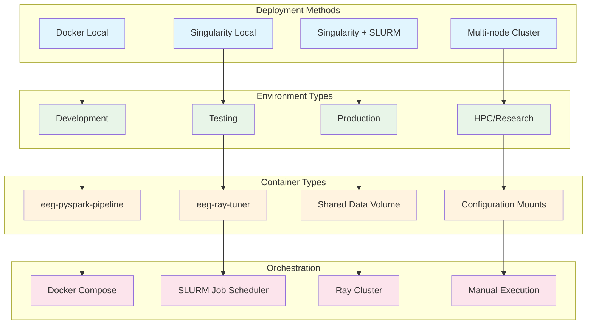
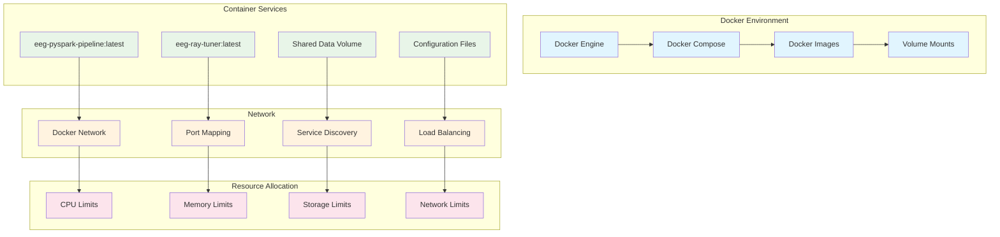
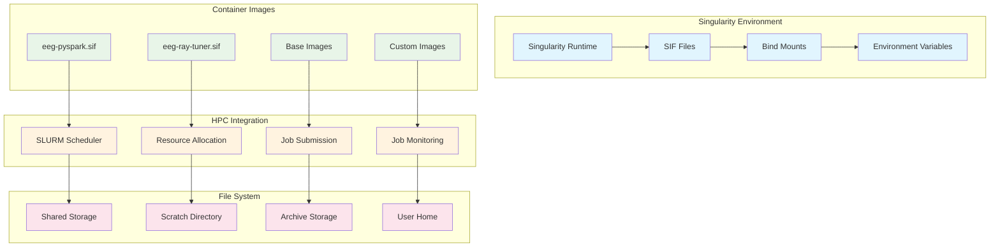
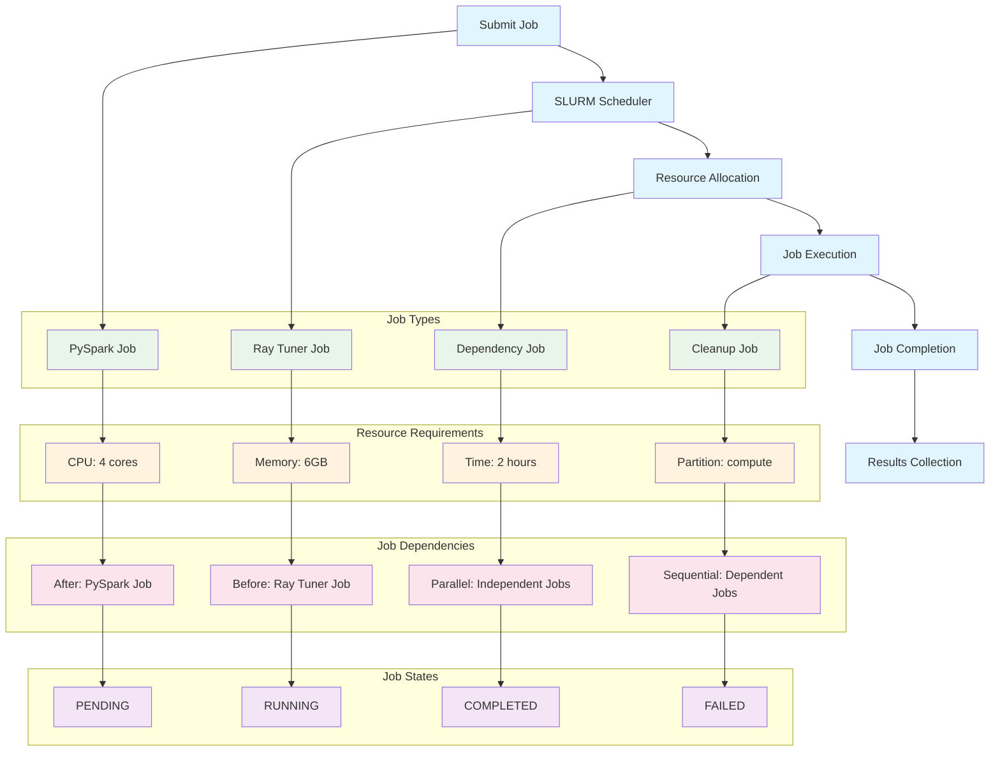
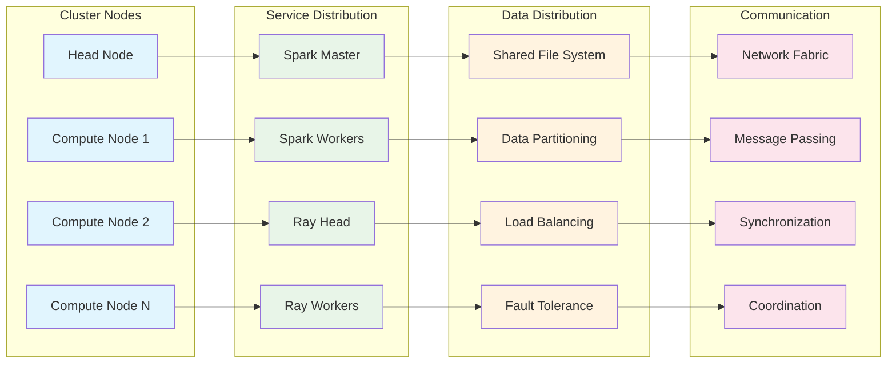
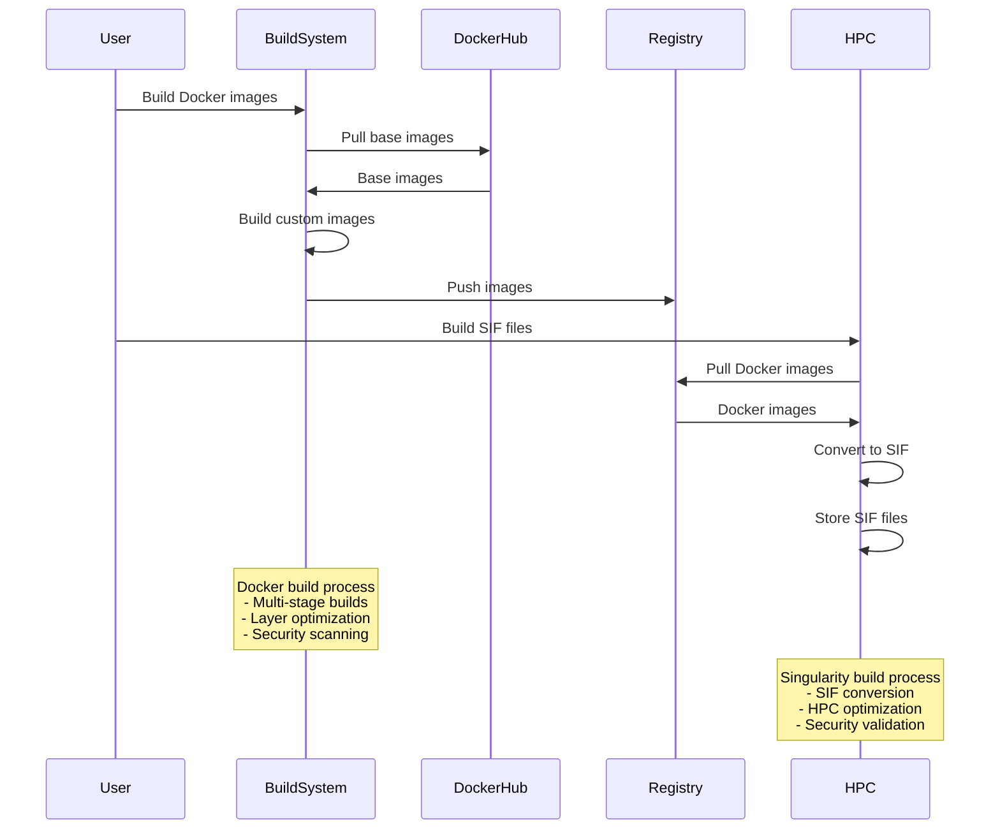
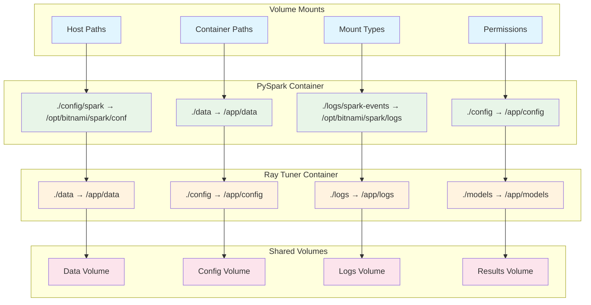
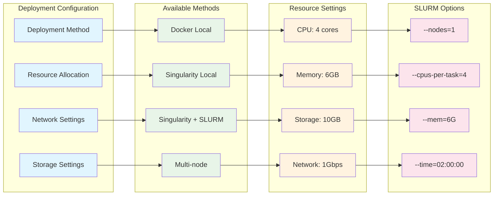

# Deployment Architecture - Container Orchestration

## Deployment Options Overview

## Docker Deployment Architecture

## Singularity Deployment Architecture

## SLURM Job Scheduling

## Multi-node Deployment

## Container Build Process

## Volume Mount Configuration

## Deployment Configuration

