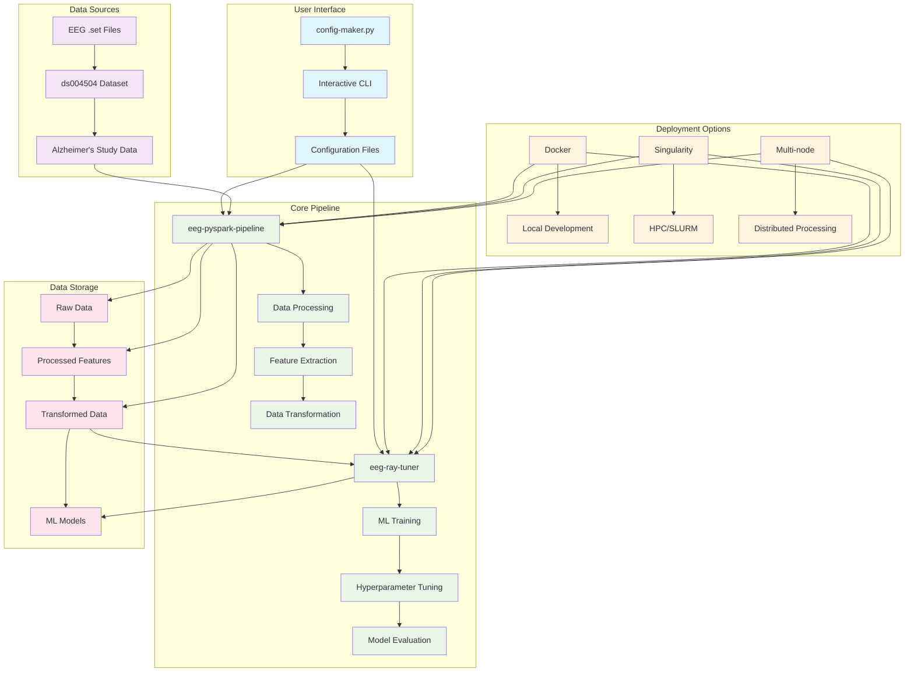
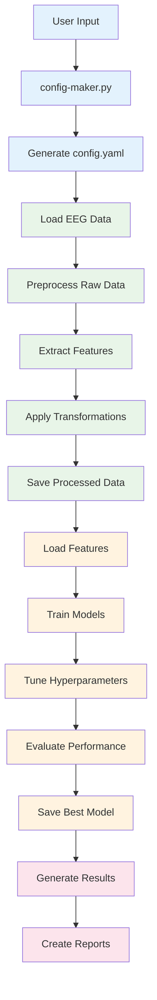
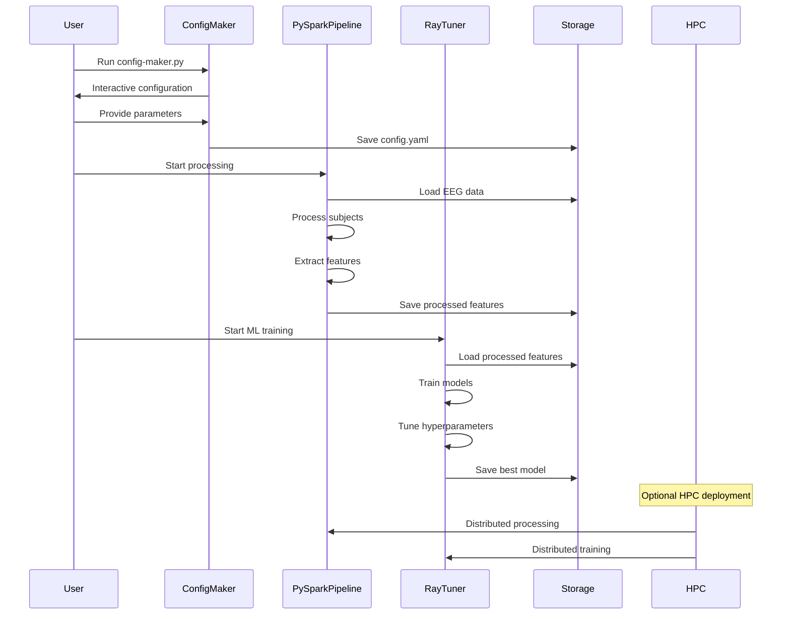
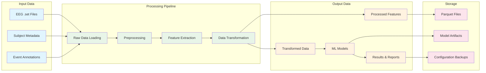

# EEG Full Pipeline - Overall Architecture

## System Overview

```mermaid
graph TB
    %% User Interface Layer
    subgraph "User Interface"
        A[config-maker.py] --> B[Interactive CLI]
        B --> C[Configuration Files]
    end

    %% Data Input Layer
    subgraph "Data Sources"
        D[EEG .set Files] --> E[ds004504 Dataset]
        E --> F[Alzheimer's Study Data]
    end

    %% Pipeline Components
    subgraph "Core Pipeline"
        G[eeg-pyspark-pipeline] --> H[Data Processing]
        H --> I[Feature Extraction]
        I --> J[Data Transformation]
        
        K[eeg-ray-tuner] --> L[ML Training]
        L --> M[Hyperparameter Tuning]
        M --> N[Model Evaluation]
    end

    %% Deployment Layer
    subgraph "Deployment Options"
        O[Docker] --> P[Local Development]
        Q[Singularity] --> R[HPC/SLURM]
        S[Multi-node] --> T[Distributed Processing]
    end

    %% Storage Layer
    subgraph "Data Storage"
        U[Raw Data] --> V[Processed Features]
        V --> W[Transformed Data]
        W --> X[ML Models]
    end

    %% Connections
    C --> G
    C --> K
    F --> G
    G --> U
    G --> V
    G --> W
    W --> K
    K --> X
    
    O --> G
    O --> K
    Q --> G
    Q --> K
    S --> G
    S --> K

    %% Styling
    classDef userInterface fill:#e1f5fe
    classDef dataSource fill:#f3e5f5
    classDef pipeline fill:#e8f5e8
    classDef deployment fill:#fff3e0
    classDef storage fill:#fce4ec
    
    class A,B,C userInterface
    class D,E,F dataSource
    class G,H,I,J,K,L,M,N pipeline
    class O,P,Q,R,S,T deployment
    class U,V,W,X storage
```

## Pipeline Flow

```mermaid
flowchart TD
    %% Configuration Phase
    A[User Input] --> B[config-maker.py]
    B --> C[Generate config.yaml]
    
    %% Data Processing Phase
    C --> D[Load EEG Data]
    D --> E[Preprocess Raw Data]
    E --> F[Extract Features]
    F --> G[Apply Transformations]
    G --> H[Save Processed Data]
    
    %% Machine Learning Phase
    H --> I[Load Features]
    I --> J[Train Models]
    J --> K[Tune Hyperparameters]
    K --> L[Evaluate Performance]
    L --> M[Save Best Model]
    
    %% Output Phase
    M --> N[Generate Results]
    N --> O[Create Reports]
    
    %% Styling
    classDef configPhase fill:#e3f2fd
    classDef processingPhase fill:#e8f5e8
    classDef mlPhase fill:#fff3e0
    classDef outputPhase fill:#fce4ec
    
    class A,B,C configPhase
    class D,E,F,G,H processingPhase
    class I,J,K,L,M mlPhase
    class N,O outputPhase
```

## Component Interaction

```mermaid
sequenceDiagram
    participant User
    participant ConfigMaker
    participant PySparkPipeline
    participant RayTuner
    participant Storage
    participant HPC

    User->>ConfigMaker: Run config-maker.py
    ConfigMaker->>User: Interactive configuration
    User->>ConfigMaker: Provide parameters
    ConfigMaker->>Storage: Save config.yaml
    
    User->>PySparkPipeline: Start processing
    PySparkPipeline->>Storage: Load EEG data
    PySparkPipeline->>PySparkPipeline: Process subjects
    PySparkPipeline->>PySparkPipeline: Extract features
    PySparkPipeline->>Storage: Save processed features
    
    User->>RayTuner: Start ML training
    RayTuner->>Storage: Load processed features
    RayTuner->>RayTuner: Train models
    RayTuner->>RayTuner: Tune hyperparameters
    RayTuner->>Storage: Save best model
    
    Note over HPC: Optional HPC deployment
    HPC->>PySparkPipeline: Distributed processing
    HPC->>RayTuner: Distributed training
```

## Data Flow Architecture

```mermaid
graph LR
    %% Data Sources
    subgraph "Input Data"
        A1[EEG .set Files]
        A2[Subject Metadata]
        A3[Event Annotations]
    end
    
    %% Processing Pipeline
    subgraph "Processing Pipeline"
        B1[Raw Data Loading]
        B2[Preprocessing]
        B3[Feature Extraction]
        B4[Data Transformation]
    end
    
    %% Output Data
    subgraph "Output Data"
        C1[Processed Features]
        C2[Transformed Data]
        C3[ML Models]
        C4[Results & Reports]
    end
    
    %% Storage
    subgraph "Storage"
        D1[Parquet Files]
        D2[Model Artifacts]
        D3[Configuration Backups]
    end
    
    A1 --> B1
    A2 --> B1
    A3 --> B1
    
    B1 --> B2
    B2 --> B3
    B3 --> B4
    
    B4 --> C1
    B4 --> C2
    C2 --> C3
    C3 --> C4
    
    C1 --> D1
    C3 --> D2
    C4 --> D3
    
    %% Styling
    classDef input fill:#e1f5fe
    classDef processing fill:#e8f5e8
    classDef output fill:#fff3e0
    classDef storage fill:#fce4ec
    
    class A1,A2,A3 input
    class B1,B2,B3,B4 processing
    class C1,C2,C3,C4 output
    class D1,D2,D3 storage
``` 