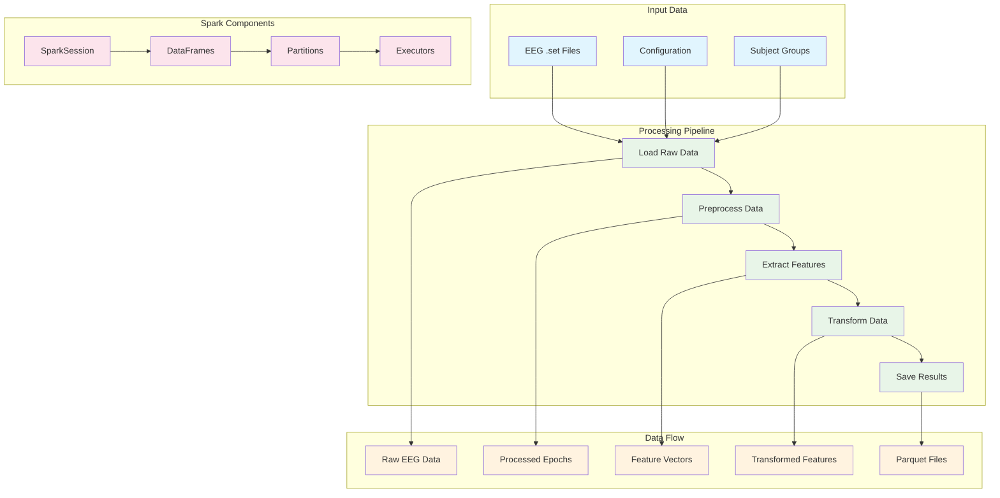
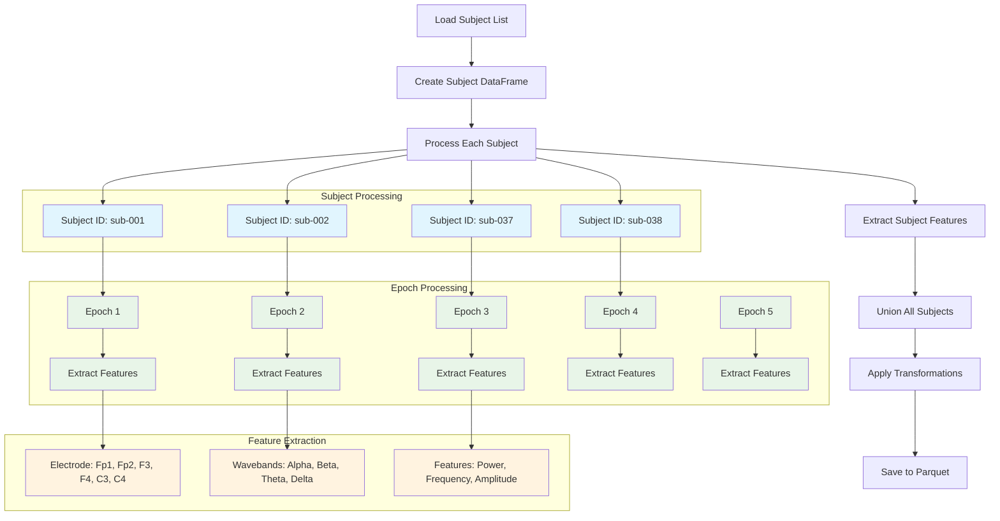
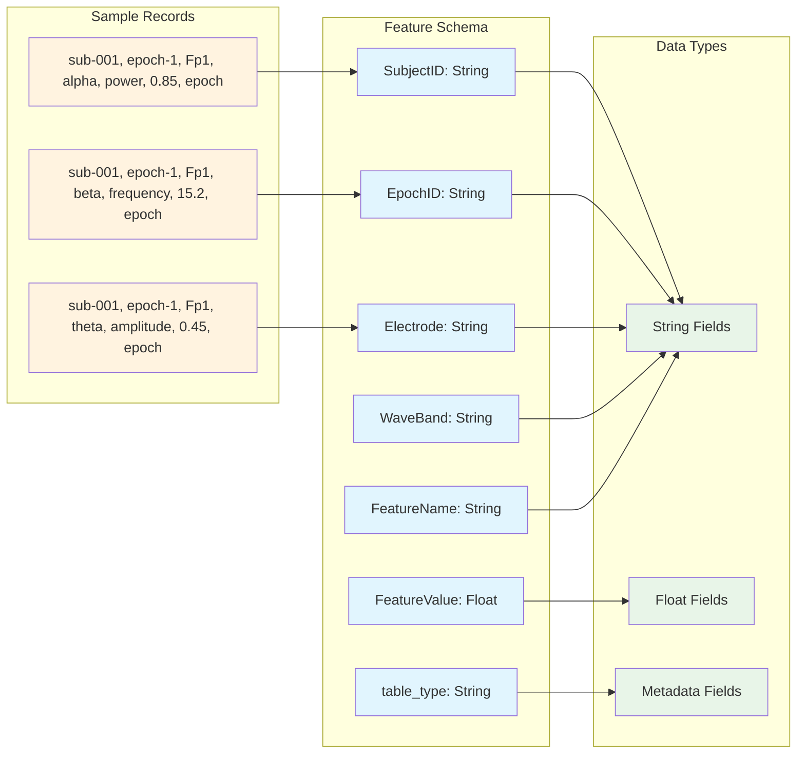
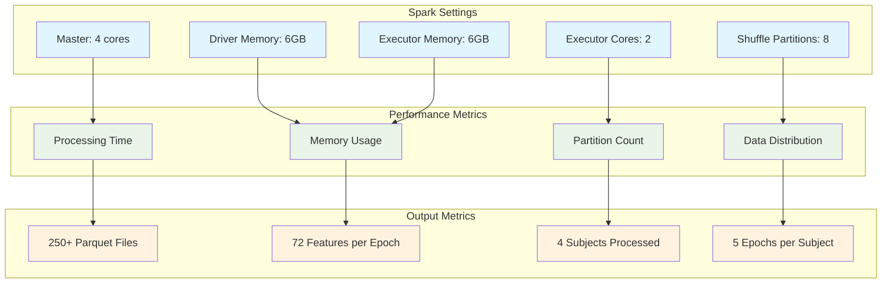
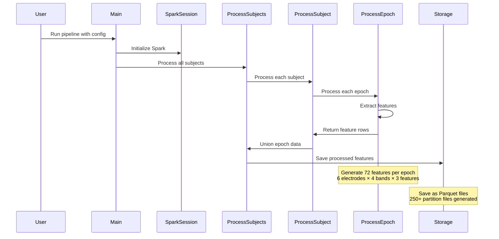

# PySpark Pipeline - Detailed Architecture

## Data Processing Flow

```mermaid
graph TB
    %% Input Layer
    subgraph "Input Data"
        A1[EEG .set Files]
        A2[Configuration]
        A3[Subject Groups]
    end
    
    %% Processing Stages
    subgraph "Processing Pipeline"
        B1[Load Raw Data]
        B2[Preprocess Data]
        B3[Extract Features]
        B4[Transform Data]
        B5[Save Results]
    end
    
    %% Data Flow
    subgraph "Data Flow"
        C1[Raw EEG Data]
        C2[Processed Epochs]
        C3[Feature Vectors]
        C4[Transformed Features]
        C5[Parquet Files]
    end
    
    %% Spark Components
    subgraph "Spark Components"
        D1[SparkSession]
        D2[DataFrames]
        D3[Partitions]
        D4[Executors]
    end
    
    %% Connections
    A1 --> B1
    A2 --> B1
    A3 --> B1
    
    B1 --> C1
    B1 --> B2
    B2 --> C2
    B2 --> B3
    B3 --> C3
    B3 --> B4
    B4 --> C4
    B4 --> B5
    B5 --> C5
    
    D1 --> D2
    D2 --> D3
    D3 --> D4
    
    %% Styling
    classDef input fill:#e1f5fe
    classDef processing fill:#e8f5e8
    classDef data fill:#fff3e0
    classDef spark fill:#fce4ec
    
    class A1,A2,A3 input
    class B1,B2,B3,B4,B5 processing
    class C1,C2,C3,C4,C5 data
    class D1,D2,D3,D4 spark
```

## Subject Processing Flow

```mermaid
flowchart TD
    %% Subject Processing
    A[Load Subject List] --> B[Create Subject DataFrame]
    B --> C[Process Each Subject]
    C --> D[Extract Subject Features]
    D --> E[Union All Subjects]
    E --> F[Apply Transformations]
    F --> G[Save to Parquet]
    
    %% Subject Details
    subgraph "Subject Processing"
        H[Subject ID: sub-001]
        I[Subject ID: sub-002]
        J[Subject ID: sub-037]
        K[Subject ID: sub-038]
    end
    
    %% Epoch Processing
    subgraph "Epoch Processing"
        L[Epoch 1] --> M[Extract Features]
        N[Epoch 2] --> O[Extract Features]
        P[Epoch 3] --> Q[Extract Features]
        R[Epoch 4] --> S[Extract Features]
        T[Epoch 5] --> U[Extract Features]
    end
    
    %% Feature Extraction
    subgraph "Feature Extraction"
        V[Electrode: Fp1, Fp2, F3, F4, C3, C4]
        W[Wavebands: Alpha, Beta, Theta, Delta]
        X[Features: Power, Frequency, Amplitude]
    end
    
    C --> H
    C --> I
    C --> J
    C --> K
    
    H --> L
    I --> N
    J --> P
    K --> R
    
    M --> V
    O --> W
    Q --> X
    
    %% Styling
    classDef subject fill:#e1f5fe
    classDef epoch fill:#e8f5e8
    classDef feature fill:#fff3e0
    
    class H,I,J,K subject
    class L,M,N,O,P,Q,R,S,T,U epoch
    class V,W,X feature
```

## Feature Schema Architecture

```mermaid
graph LR
    %% Schema Definition
    subgraph "Feature Schema"
        A[SubjectID: String]
        B[EpochID: String]
        C[Electrode: String]
        D[WaveBand: String]
        E[FeatureName: String]
        F[FeatureValue: Float]
        G[table_type: String]
    end
    
    %% Data Types
    subgraph "Data Types"
        H[String Fields]
        I[Float Fields]
        J[Metadata Fields]
    end
    
    %% Sample Data
    subgraph "Sample Records"
        K["sub-001, epoch-1, Fp1, alpha, power, 0.85, epoch"]
        L["sub-001, epoch-1, Fp1, beta, frequency, 15.2, epoch"]
        M["sub-001, epoch-1, Fp1, theta, amplitude, 0.45, epoch"]
    end
    
    A --> H
    B --> H
    C --> H
    D --> H
    E --> H
    F --> I
    G --> J
    
    K --> A
    L --> B
    M --> C
    
    %% Styling
    classDef schema fill:#e1f5fe
    classDef types fill:#e8f5e8
    classDef sample fill:#fff3e0
    
    class A,B,C,D,E,F,G schema
    class H,I,J types
    class K,L,M sample
```

## Spark Configuration

```mermaid
graph TB
    %% Spark Configuration
    subgraph "Spark Settings"
        A[Master: 4 cores]
        B[Driver Memory: 6GB]
        C[Executor Memory: 6GB]
        D[Executor Cores: 2]
        E[Shuffle Partitions: 8]
    end
    
    %% Performance
    subgraph "Performance Metrics"
        F[Processing Time]
        G[Memory Usage]
        H[Partition Count]
        I[Data Distribution]
    end
    
    %% Results
    subgraph "Output Metrics"
        J[250+ Parquet Files]
        K[72 Features per Epoch]
        L[4 Subjects Processed]
        M[5 Epochs per Subject]
    end
    
    A --> F
    B --> G
    C --> G
    D --> H
    E --> I
    
    F --> J
    G --> K
    H --> L
    I --> M
    
    %% Styling
    classDef config fill:#e1f5fe
    classDef metrics fill:#e8f5e8
    classDef results fill:#fff3e0
    
    class A,B,C,D,E config
    class F,G,H,I metrics
    class J,K,L,M results
```

## Data Processing Stages

```mermaid
sequenceDiagram
    participant User
    participant Main
    participant SparkSession
    participant ProcessSubjects
    participant ProcessSubject
    participant ProcessEpoch
    participant Storage
    
    User->>Main: Run pipeline with config
    Main->>SparkSession: Initialize Spark
    Main->>ProcessSubjects: Process all subjects
    
    ProcessSubjects->>ProcessSubject: Process each subject
    ProcessSubject->>ProcessEpoch: Process each epoch
    ProcessEpoch->>ProcessEpoch: Extract features
    ProcessEpoch->>ProcessSubject: Return feature rows
    ProcessSubject->>ProcessSubjects: Union epoch data
    ProcessSubjects->>Storage: Save processed features
    
    Note over ProcessEpoch: Generate 72 features per epoch<br/>6 electrodes × 4 bands × 3 features
    Note over Storage: Save as Parquet files<br/>250+ partition files generated
``` 