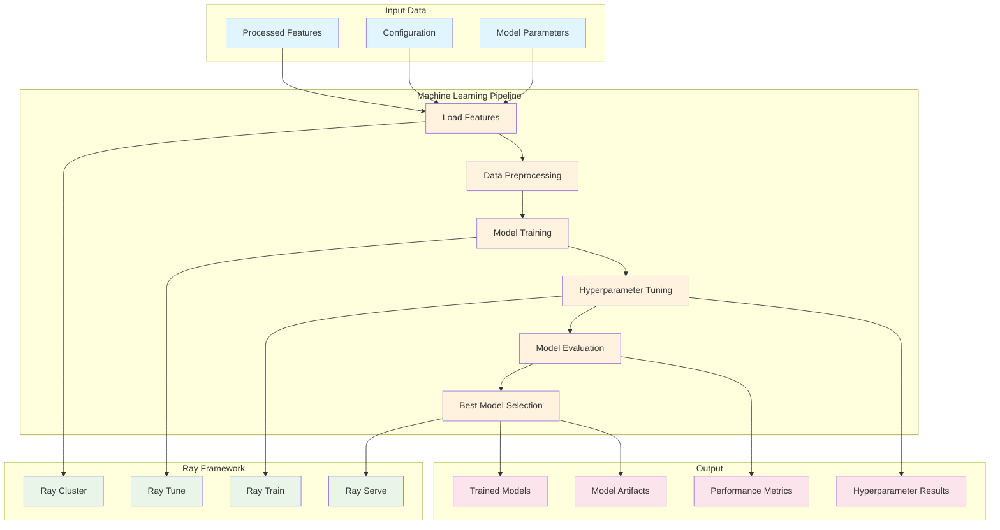
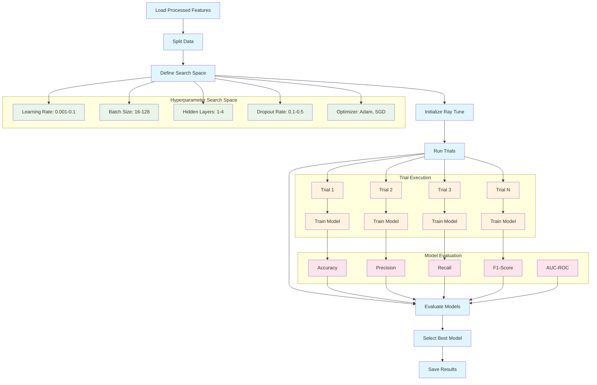
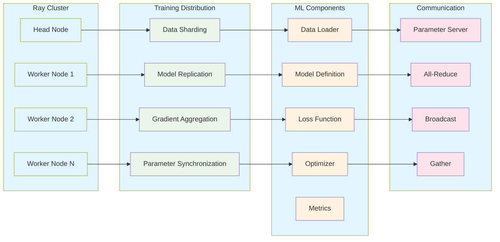
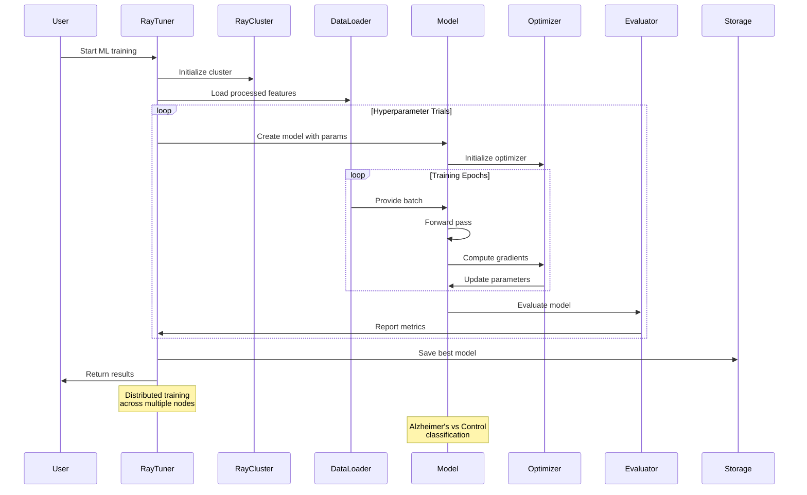
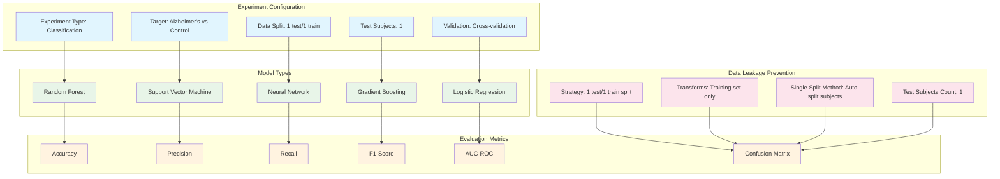
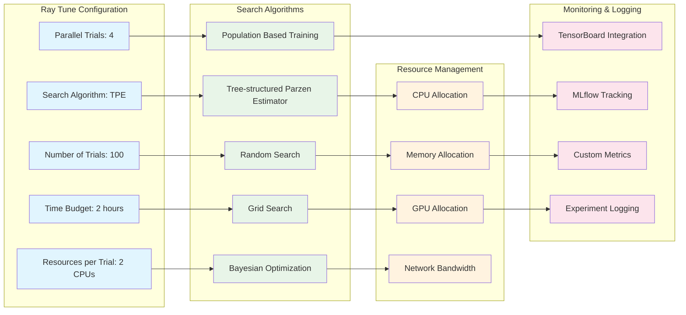

# Ray Tuner - Machine Learning Architecture

## ML Training Flow

## Hyperparameter Tuning Process

## Distributed Training Architecture

## Model Training Sequence

## Experiment Configuration

## Ray Tune Configuration

