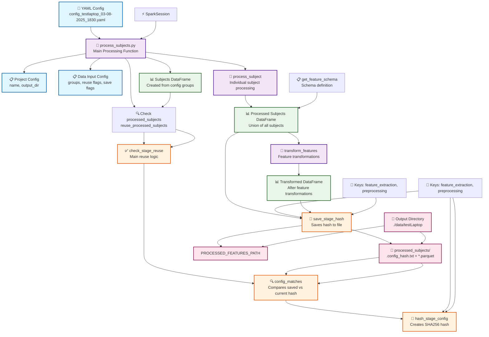

# EEG Pipeline Hashing Flow



## 🔄 **Process Flow Explanation**

### **1. Configuration Loading**
- YAML config file contains all settings
- `process_subjects()` extracts project and data input configs
- Config determines reuse/save behavior for each stage

### **2. Hash-Based Reuse System**
- **`check_stage_reuse()`**: Main entry point for reuse logic
- **`config_matches()`**: Compares current config hash with saved hash
- **`hash_stage_config()`**: Creates SHA256 hash of relevant config keys
- **`save_stage_hash()`**: Saves hash to `.config_hash.txt` file

### **3. Stage-Specific Processing**

#### **Processed Subjects Stage**
- **Keys**: `["feature_extraction", "preprocessing"]`
- **Reuse Flag**: `reuse_processed_subjects`
- **Save Flag**: `save_processed_subjects`
- **Path**: `./data/testLaptop/processed_subjects/`

### **4. Data Processing Pipeline**
1. **Extract subjects** from config groups
2. **Check for existing data** using hash validation
3. **Process subjects** (if not reusing) using DataFrames
4. **Save processed subjects** (if configured)
5. **Apply transformations** (if not 'None')
6. **Save transformed features** (if configured)

### **5. Hash File Structure**
```
./data/testLaptop/
├── processed_subjects/
│   ├── .config_hash.txt    # Hash of feature_extraction + preprocessing
│   └── *.parquet          # Processed subjects data
└── transformed/
    ├── .config_hash.txt    # Hash of feature_transformation + feature_extraction
    └── *.parquet          # Transformed features data
```

## 🎯 **Key Benefits**

1. **Reproducibility**: Identical configs always produce identical outputs
2. **Performance**: Skip recomputation when configs haven't changed
3. **Safety**: Prevent silent reuse of outdated outputs
4. **Transparency**: Clear logging of reuse decisions
5. **Flexibility**: Stage-specific config tracking
6. **Schema Enforcement**: DataFrame approach with proper schema validation

## 🔧 **Integration Points**

- **`process_subjects()`**: Orchestrates the entire pipeline
- **`data_io.py`**: Provides all hashing and reuse functionality
- **`process_subject()`**: Individual subject processing
- **`transform_features()`**: Feature transformations
- **`get_feature_schema()`**: Schema definition for DataFrames

This hierarchical approach ensures your EEG processing pipeline is both efficient and reproducible! 🚀 